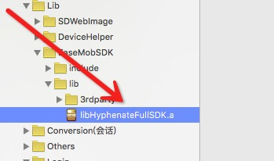
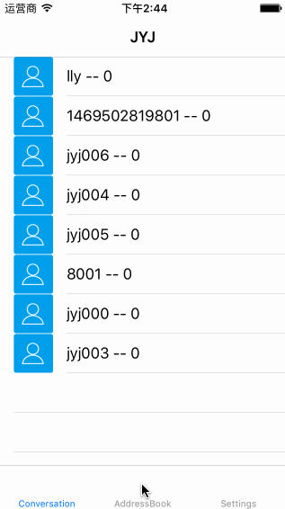

# JYJChat
模仿微信聊天，集成环信3.X。

### 由于环信.a文件太大，大家需要先去环信官网下载.a,

然后加到项目中，就可以运行了。
# GIF

# message
 `JYJChat` 集成了环信的聊天功能，添加群组，添加好友，视频聊天，语音聊天。特是对键盘，的输入，弹出做了非常完美的控制，非常像微信，只有具体功能没时间添加

# 联系我
 QQ 453255376, 如有bug、不明白的，希望大家踊跃联系我，把程序写的更好。
 
